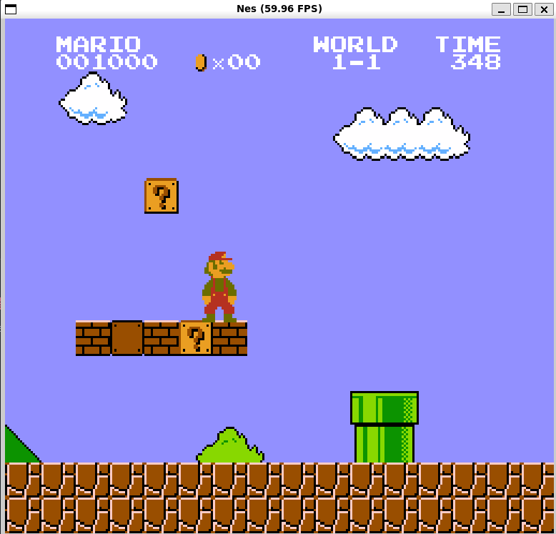

# ctlNESs

ctlNESs is a NES emulator written in [CTL](https://github.com/nw-github/ctl). It's primary purpose was to gauge the current state of the language from a usability standpoint with a medium sized project (and to cross "create an emulator" off my bucket list), rather than an attempt to make a featureful or accurate emulator.

## Examples




## Usage

To compile the project, run the following command. You will need SDL2 installed.

```
ctl b -qio -lSDL2 -lrt -lm ./ctlness ctlness
```

Then, run the resulting `ctlness` binary with the path to the desired rom

```
ctlness "roms/Super Mario Bros.nes"
```

Alternatively, you can do both in one command

```
ctl r -qio -lSDL2 -lrt -lm ./ctlness -- "roms/Super Mario Bros.nes"
```

The controls are hardcoded to the following values (for both controllers):

-   DPAD Up: W
-   DPAD Left: A
-   DPAD Down: S
-   DPAD Right: D
-   B: U
-   A: I
-   Start: Enter
-   Select: Tab
-   Reset: R

## Features

A few of the most popular mappers are implemented. This includes:

-   iNES 000: Super Mario Bros.
-   iNES 001: Legend of Zelda, Metroid, Tetris
-   iNES 002: Ducktales, Megaman
-   iNES 004: Super Mario Bros. 2, Super Mario Bros. 3

Saves for battery-backed cartridges are persisted as a `.nsav` file right next to the rom file. This file is a byte-for-byte dump of the 8192 bytes of SRAM located at $6000 - $7FFF. If the file exists and is 8192 bytes long, the emulator will load it into memory.

## Limitations

Not all versions of the various mappers are implemented, so some games may not work as expected. Only NTSC roms are supported.

Audio emulation is experimental. It is currently mostly a port from [ANESE](https://github.com/daniel5151/ANESE), but probably has a few bugs of my own thrown in. The channels can be individually muted and unmuted with number row keys 6 through 0.

The "illegal" (undocumented) 6502 instructions are not implemented, any games that rely on them will not work correctly.

Savestates are not currently supported.

## Tested Games

-   Super Mario Bros. (several worlds)
-   Super Mario Bros. 2 (world one)
-   Super Mario Bros. 3 (several worlds)
-   The Legend of Zelda (most areas)
-   Mega Man (title screen)
-   Metroid (title screen)
-   Pac-Man (one level)
-   Ducktales (one level)
-   Tetris
-   Zelda II - The Adventure of Link

## Credits

These are the sources of documentation and code repositories used as a reference when building this emulator.

-   [NesDev Wiki](https://www.nesdev.org/wiki/Nesdev_Wiki)
-   [6502 Opcodes](https://www.oxyron.de/html/opcodes02.html)
-   [ANESE](https://github.com/daniel5151/ANESE)
-   [SimpleNES](https://github.com/amhndu/SimpleNES)
